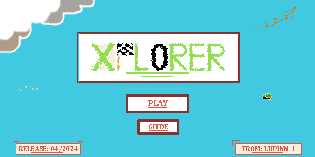
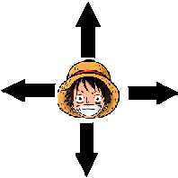
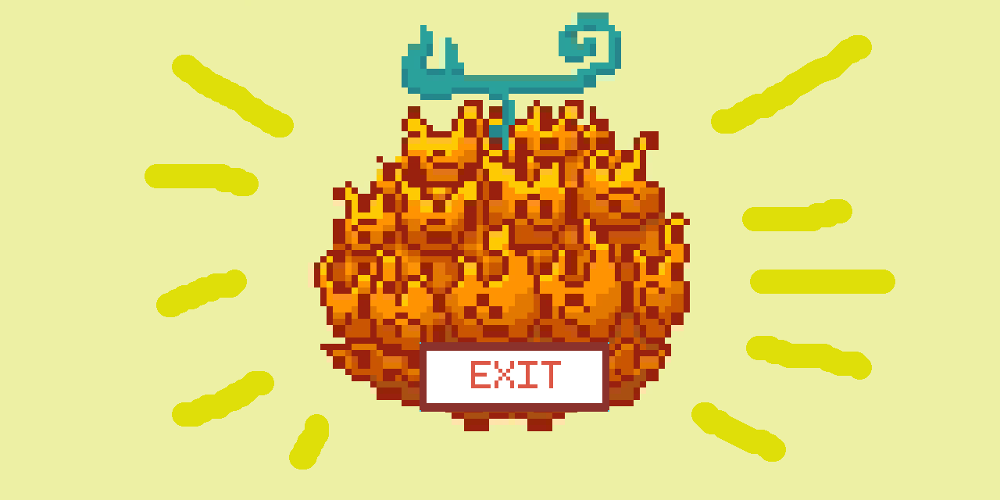
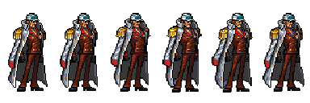
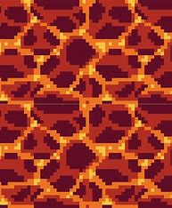
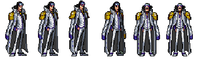

# **Game assignment for AdvProg-23/24**
---

# XPLORER - ONE PIECE EDITION
# Mục Lục
- [**Game assignment for AdvProg-23/24**](#game-assignment-for-advprog-2324)
- [XPLORER - ONE PIECE EDITION](#xplorer---one-piece-edition)
- [Mục Lục](#mục-lục)
- [Mô tả](#mô-tả)
- [Hướng dẫn chơi](#hướng-dẫn-chơi)
  - [Cách chơi:](#cách-chơi)
  - [Các thành phần trong game:](#các-thành-phần-trong-game)
- [Cách cài đặt](#cách-cài-đặt)
- [Về Source Code](#về-source-code)

# Mô tả
> Luffy đang bị lạc khỏi băng hải tặc của mình.
> 
> Không có những đồng đội, anh quyết tự mình đi tìm kho báu *"Two Piece"* trong truyền thuyết để lấy thêm Trái Ác Quỷ cho thuyền phó Zoro cũng đang đi lạc đâu đó.
>
> Trong hành trình ấy, Luffy vô tình chạm trán với 3 Đô đốc Hải quân đang bảo vệ *"Two Piece"*.
>
> Hãy cùng Luffy vượt qua các chướng ngại mà 3 tên Đô đốc tạo ra để khám pha Trái Ác Quỷ đang nằm trong chiếc rương bí ẩn.
>
**Xem thêm tại:**

---
# Hướng dẫn chơi
## Cách chơi:
***1. Điều khiển***

- Dùng các phím mũi tên UP, DOWN, LEFT, RIGHT để di chuyển nhân vật.

- Nhấn giữ phím `D` để tăng tốc.
***2.Lối chơi***

- Trên bản đồ có những cuộn cổ tự, di chuyển nhân vật đến đó và trả lời những câu đố trong cuộn giấy đó để nhận được các mảnh chìa khóa.
- Thu thập đủ 4 mảnh chìa mới có thể mở được rương kho báu.
- Di chuyển tránh những block nguy hiểm của các đô đốc, nếu không muốn bị mất mạng.

> *Mỗi lượt chơi chỉ có 5 mạng.* 
- Chiến thắng:
  - Thu thập đủ 4 mảnh chìa khóa và di chuyển đến chiếc rương cuối map để chiến thắng.
   
  - Phần thưởng sẽ là 1 trong 3 trái Ác Quỷ với sức mạnh đặc biệt:
    - *Trái Lửa*  *- Mera Mera*: 
  
    - *Trái Heart* - *Ope Ope*:
  
    - Đặc biệt là trái *Gomu Gomu no Mi* (Trái Main) với sức mạnh vô cùng hợp logic (**logic anime**) nhờ bộ não của tác giả Oda 
  

## Các thành phần trong game:
***1.Chó đỏ (AKAINU)***

- Với sức mạnh của trái `Magma`, hắn có thể điều khiển các khối Magma tấn công Luffy.
- 
- Đạn Magma: Các viên đạn Magma có thể di chuyển để tấn công Luffy.
  
- Nóng chảy: Biến mặt đất dưới chân Luffy thành Magma siêu nóng.
  
***2.Chim xanh (Kuzan/Aokiji)***

- Với sức mạnh của trái `Hơi Lạnh`, hắn có thể điều khiển các khối băng tuyết tấn công Luffy.
- 
- Gai băng: Các khối băng sắc nhọn mọc để tấn công Luffy.
  
- Băng trơn: Biến mặt đất dưới chân Luffy thành mặt băng trơn trượt
  
- Buốt óc: Khối hơi lạnh đến nối làm rối loạn cách Luffy di chuyển
  
 - Băng đạn: Các viên đạn băng có thể di chuyển để tấn công Luffy
  
***3.Khỉ vàng (Kizaru/Bosalino)***
- Với sức mạnh cảu trái `Ánh Sáng`, hắn có thể dùng chúng tấn công Luffy làm cậu choáng váng và di chuyển lung tung.

- Chớp sáng: Cẩn thận với những chùm sáng này nếu không muốn bị đưa đến những nơi nguy hiểm
 
- Quang cầu: Những quả cầu ánh sáng bay theo mọi hướng để gây khó cho Luffy
 

 # Cách cài đặt
 - Tại nút Code ở Repo này: 
   - Copy đường dẫn
   - Tạo thư mục
   - Mở CommandLine
   - Gõ lệnh `git clone + URL`
- Hoặc tải file Zip **tại đây** (without srcCode)

# Về Source Code
Cụ thể về cấu trúc của game:
**1. Folder GUI :**
- Lưu trữ các file ảnh png đã sử dụng.

**2. Folder Mixer:**
- Lữu trữ các file âm thanh trong game đã sử dụng.

**3. Main.cpp :**
- Chạy chương trình chính và thực hiện gameloop đến khi game kết thúc (`isrunning == false`)

**4. Game.h:**
- Định nghĩa cấu trúc game cùng các hàm chính và các biến renderer window toàn cục sử dụng cho project
- init(): Khởi tạo các biến và thực thể trong game play.
- update(): Cập nhật các trạng thái liên tục của game dựa trên input của người chơi và logic sẵn có của game được triển khai trong `game.cpp`
- render(): Hiển thị các trạng thái Game lên window để tương tác với người dùng.
- clear(): Hủy bỏ các biến khi game kết thúc.

**5. Game.cpp :**
- Triển khai các hàm đã định nghĩa ở file header
- Thực hiện các logic chính của game
- Xử lí các va chạm và tương tác của người chơi với chương trình
- Xử lí các file hình ảnh và âm thanh

**6.ECS.h**
- Định nghĩa cấu trúc ECS cho hệ thống trò chơi
- Gồm 3 thành phần:
  - **Entity:** các đối tượng chính trong trò chơi (nhân vật, các khối địa hình, các block,..)
  - **Component:** là những class lưu trữ dữ liệu mô tả cho những đặc tính của các entity cụ thể trong game này là:
    - `TransformComponent.h`: quản lí vị trí và kích thước thông qua các tọa độ Vecto từ đó xử lí di chuyển của vật thể trong game.
    - `SpriteComponent.h`:  quản lí hình ảnh của nhân vật được in lên màn hình đồng thời xử lí animation cho những vật thể động theo ý muốn.
    - `CollideComponet.h`: sử dụng các khối rect dựa trên tọa độ và kích thước của vật thể để xử lí các va chạm trong game.
    - `AutoComponent.h `: làm cho các vật thể có thể tự di chuyển nhờ cộng thêm chỉ số vào tọa độ của chúng ở TransformComponent, xử lí hướng di chuyển thông qua chỉ số dir(direction) theo chiều của x và y.
    - `KeyboardHandling.h`: Xử lí các input của người chơi thông qua bàn phím để thay đổi vị trí của vật thể trong game.
  - **Manager:** : quản lí , triển khai các components, entities của hệ thống thông qua update(), draw(),refresh();
    
**7.Vector2D.h và Vector2D.cpp**
- Định nghĩa kiểu dữ liệu Vector và các phép toán liên quan để xử lí tọa độ vật thể.

**8.Collision.h và Collision.cpp**
- Định nghĩa hàm bool kiểm tra sự va chạm giữa các vật thể phục vụ cho xử lí các va chạm trong game.cpp 

**9.Texture.h và Texture.cpp**
- Định nghĩa các hàm xử lí và hiển thị hình ảnh sử dụng xuyên suốt project sử dụng các hàm của SDL2_image
- Rút ngắn cú pháp so với chỉ dùng các hàm của SDL.

**10.Anima.h**
- Định nghĩa class *Anima* để xử lí hoạt ảnh của các vật thể động được triển khai trong SpriteComponent.

